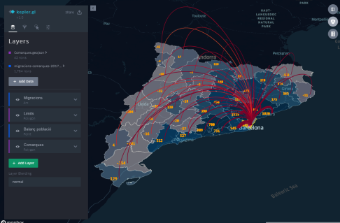

# kepler-datasets

Stunning visualizations using Kepler.gl and Open Datasets

## Visualizations

* [Accidents en carretera 2010-2016](https://kepler.gl/#/demo?mapUrl=https://raw.githubusercontent.com/geostarters/kepler-datasets/master/accidents_en_carretera_2010_2016.json)

 * [Migracions entre comarques 2017](https://kepler.gl/#/demo?mapUrl=https://raw.githubusercontent.com/geostarters/kepler-datasets/master/migracio-comarcal-arcs-2017.json)

 * [Ús estacions Bicing 12 hores](https://kepler.gl/#/demo?mapUrl=https://raw.githubusercontent.com/geostarters/kepler-datasets/master/estacions-bicing-12h.json)

  * [Explotacions ramaderes Catalunya](https://kepler.gl/#/demo?mapUrl=https://raw.githubusercontent.com/geostarters/kepler-datasets/master/explotacions-ramaderes.json)

   * [Explotacions ramaderes Catalunya: Granges de Cargols](https://kepler.gl/#/demo?mapUrl=https://raw.githubusercontent.com/geostarters/kepler-datasets/master/explotacions-ramaderes-cargols.json)

  * [Simulació desplaçaments comissaries i accidents trànsit](https://kepler.gl/#/demo?mapUrl=https://raw.githubusercontent.com/geostarters/kepler-datasets/master/keplergl-simulacio-accidents.json)  

 #### Datasets from:

 * [http://opendata-ajuntament.barcelona.cat/](http://opendata-ajuntament.barcelona.cat/)
 * [http://governobert.gencat.cat/ca/dades_obertes/](http://governobert.gencat.cat/ca/dades_obertes/)
 * [https://www.idescat.cat/](https://www.idescat.cat/)